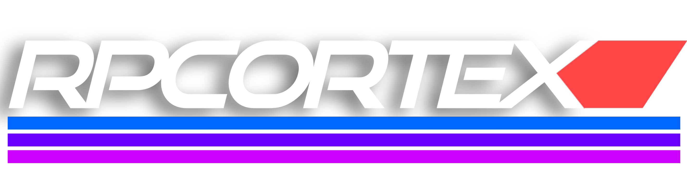

   <a href="https://github.com/dash1101/RPCortex">
     

       
     

   </a>

   
   
   

# RPCortex - Lightweight Customizable OS 🖥️

RPCortex is an **open-source** operating system designed for **RP2040** and **RP2350 processors**. It provides a **CLI-based** environment with an optional GUI and an ecosystem of packages, including **networking tools, development utilities, and system management features**.

## 🌟 Features
- **CLI Interface** 🖥️
- **Modular Package Management** 📦
- **Networking Tools & Development Utilities** 🌐
- **User & System Process Management** ⚙️
- **Lightweight & Customizable** 🛠️
- **OS Updating System & Recovery** 🔃
- **Modular Directory System** 📂
- **Nova D1 Support** 🛜

## 🚀 Getting Started
To install **RPCortex**, follow these steps:
1. Download the latest release from [GitHub Releases](https://github.com/dash1101/RPCortex/releases).
2. Copy the OS files onto your target device.
3. Boot into RPCortex and configure your user environment.

### 🔧 Recommended System Requirements
- **MicroPython-supported RP2040 / RP2350 processor**
- **MicroPython Version:** v1.25.X
- **Storage:** 4MB Flash Memory
- **RAM:** 256KB

## 📋 Status & Roadmap
For RPC β8X - Nebula release v0.8.0-beta:
| Phase          | Status  | Estimated Dates |
|---------------|---------|----------------|
| **Initiation**   | ✅ Completed  | 3/2 - 3/4 |
| **Planning**    | ✅ Semi-Completed  | 3/5 - 3/12 |
| **Development** | 🏗️ In-Progress  | Q2 - Q3 2025 |
| **Testing**     | 🧪 Projected  | Q3 2025 |
| **Finalization**| 🚀 Projected  | Q3 2025 |

## 📦 Package Management
RPCortex β8X features a **built-in package manager** with:
- **Local package installation**
- **Online package repositories**
- **Remote URL-based installation**
- **Automatic & manual package updates**
- **Full package removal support**

## 🛠️ Development & Contributions
We welcome contributions! Please refer to our **[Contribution Guide](https://github.com/dash1101/RPCortex/blob/main/CONTRIBUTING.md)** before submitting a PR.

## 🔒 License
RPCortex is open-source but requires **explicit credit** to **[@dash1101](https://github.com/dash1101)** for use in public projects. Read more in the **[LICENSE](https://github.com/dash1101/RPCortex/blob/main/LICENSE)** file.

## 🌐 Resources
- 📖 **[Documentation](https://github.com/dash1101/RPCortex/wiki)**
- 🐛 **[Issue Tracker](https://github.com/dash1101/RPCortex/issues)**
- 💬 **[Community Discussions](https://github.com/dash1101/RPCortex/discussions)**
- 🔥 **[Latest Releases](https://github.com/dash1101/RPCortex/releases)**

---

###### Footnote: This is describing RPC-β8X (v0.8.0) which has not yet released.
