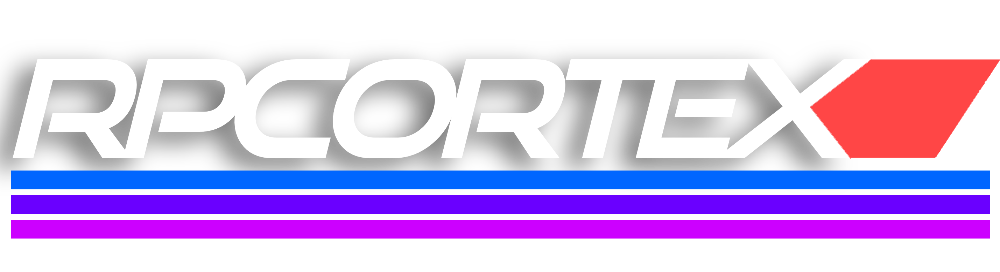

   <a href="https://github.com/dash1101/RPCortex">
     <p align="center">
       
     </p>
   </a>

   <a href="https://github.com/dash1101/RPCortex"></a>
   <a href="https://github.com/dash1101/RPCortex/issues"></a>
   <a href="https://github.com/dash1101/RPCortex/blob/main/LICENSE"></a>

---

# RPCortex — Nebula β8X

A lightweight CLI operating system for the Raspberry Pi Pico and RP2040/RP2350-based boards, written entirely in MicroPython. Real user accounts, a package manager, WiFi networking, a text editor, and a proper boot sequence — all on hardware with 264KB of RAM.

> **v0.8.0-rc** — Release candidate. Core features are stable and functional.

---

## Features

- **Interactive CLI shell** — colored prompt, full cursor navigation, command history, session logging
- **Full filesystem commands** — `ls`, `cd`, `mv`, `cp`, `rm`, `tree`, `df`, and more
- **User accounts** — salted SHA256 passwords, multi-user support, home directories, account management from the shell
- **WiFi networking** — scan, connect, saved networks, autoconnect on boot (Pico W and ESP32)
- **HTTP/HTTPS client** — `wget` streams to flash, `curl` fetches to screen, `runurl` downloads and executes, `ping` + `nslookup`
- **Apt-style package manager** — `pkg install/remove/upgrade/search/available`, configure repos, no reboot required after changes
- **Built-in text editor** — nano-style editor via `edit` / `nano` (requires serial terminal)
- **POST (Power-On Self Test)** — registry check, CPU test, RAM stress test, clock detection, WiFi autoconnect
- **Registry** — INI-style persistent config for system settings, network credentials, hardware info
- **Settings TUI** — interactive ANSI panel for toggling common settings without editing the registry
- **Session logging** — every boot session logged to `/Nebula/Logs/`, rotated up to 10 logs
- **Recovery shell** — unauthenticated fallback shell if the main boot sequence fails
- **Neofetch-style system info** — `fetch` shows board, CPU, RAM, flash, uptime, UID

---

## Supported Hardware

| Board | Status |
|-------|--------|
| Raspberry Pi Pico (RP2040) | ✅ Primary target |
| Raspberry Pi Pico W (RP2040 + WiFi) | ✅ Full WiFi support |
| Raspberry Pi Pico 2 (RP2350) | ✅ Supported |
| Raspberry Pi Pico 2 W (RP2350 + WiFi) | ✅ Should work |
| ESP32 / ESP32-S2 / ESP32-S3 | ✅ Works well — package manager confirmed |

---

## Getting Started

1. Flash MicroPython firmware to your board (v1.20+, v1.27+ recommended)
2. Copy all files from this repo onto the board's filesystem
3. Connect via serial terminal at **115200 baud** (PuTTY recommended)
4. Reboot — `main.py` runs automatically
5. Complete the first-run setup to create your `root` account
6. Log in and you're in the shell

**Note:** Thonny's REPL works but has quirks (no arrow key history, occasional double-printed input). Use PuTTY or a similar serial terminal for the best experience.

---

## Package Manager

```
pkg repo add https://raw.githubusercontent.com/dash1101/RPCortex/main/repo/index.json
pkg update
pkg available
pkg install HelloWorld
pkg list
pkg upgrade
```

Packages are `.pkg` files (standard ZIP archives). A `make_pkg.py` build script is included in `repo/` for creating packages from a source directory on your PC. Installed commands are available immediately — no reboot needed.

---

## Shell Preview

```
dash@nebula:~> wifi status
[i] Connected  SSID: MyNetwork  IP: 192.168.1.42
dash@nebula:~> pkg available
  NAME                 VERSION    AUTHOR       DESCRIPTION
  -----------------------------------------------------------------
  HelloWorld           1.0.0      dash1101     Sample demo package
dash@nebula:~> pkg install HelloWorld
[i] Found 'HelloWorld'. Downloading...
[OK] Package 'HelloWorld' v1.0.0 installed.
dash@nebula:~> hello
  Hello from HelloWorld!
  RPCortex package system is working correctly.
dash@nebula:~> fetch
```

---

## System Requirements

- **MicroPython** v1.27 or newer recommended
- **Flash:** 4MB (2MB minimum)
- **RAM:** 264KB (Pico 1) or 520KB (Pico 2)

---

## Documentation

- 📖 [NebulaDocs.md](NebulaDocs.md) — full command reference and system documentation
- 📋 [release.md](release.md) — release notes for v0.8.0-rc
- 🐛 [Issue Tracker](https://github.com/dash1101/RPCortex/issues)
- 💬 [Discussions](https://github.com/dash1101/RPCortex/discussions)

---

## Roadmap

| Phase | Status |
|-------|--------|
| Development | ✅ Complete |
| Release Candidate | 🔶 In progress (v0.8.0-rc) |
| Stable Release | 🚀 Targeting Q2–Q3 2026 |

**Post-RC backlog:** tab completion, shell aliases, SD card support, unified user system, log directory auto-creation.

---

## License

RPCortex is open-source. Explicit credit to **[@dash1101](https://github.com/dash1101)** is required for use in public projects. See the [LICENSE](https://github.com/dash1101/RPCortex/blob/main/LICENSE) file for details.

---

###### RPC-β8X (v0.8.0-rc) — Nebula
