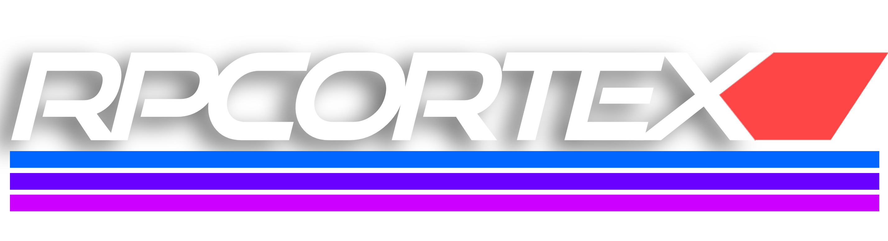

<a href="https://github.com/dash1101/RPCortex">
  <p align="center">
    
  </p>
</a>

<p align="center">
  <a href="https://github.com/dash1101/RPCortex/releases"></a>
  <a href="https://github.com/dash1101/RPCortex/issues"></a>
  <a href="https://github.com/dash1101/RPCortex/blob/main/LICENSE"></a>
  
  
  <a href="https://rpc.novalabs.app"></a>
  <a href="https://discord.gg/hcEWwSNDBa"></a>
</p>

---

# RPCortex — Vela II — v2.0.0

RPCortex is a CLI operating system for the **Raspberry Pi Pico series**
(RP2040 / RP2350), written in **C++** and running natively on the metal. It turns
a microcontroller into something that behaves like a computer — a real
interactive shell with pipes and chaining, user accounts with hashed passwords, a
package system, WiFi and Bluetooth, and a structured boot with hardware checks.

This is the successor to [RPCortex-OS](https://github.com/dash1101/RPCortex-OS),
which shipped through v1.0 "Vela" on MicroPython. Same shell, same commands, same
package system — without an interpreter underneath.
[Why the rewrite happened.](https://rpc.novalabs.app/switch)

It runs on hardware with 264 KB of RAM. That constraint is still the point.

> **Beta.** It boots, sets itself up, logs in, joins a network, installs and
> runs packages, and updates itself over the air — all confirmed on a Pico 2 W.
> It is still changing week to week. What is NOT done is listed at the bottom of
> this file rather than buried.
>
> The version stays at **v2.0.0** until it ships. What moves between builds is a
> build number, taken from the commit count so nobody has to remember it; `ver`
> prints it alongside the commit the image was built from.

---

## What it feels like

Hold BOOTSEL, plug the board in, drag one `.uf2` onto the drive that appears.
Open a serial terminal at 115200. The logo comes up in its gradient, POST reports
what it found, and five short questions follow — root password, owner, device
name, WiFi, timezone. Then:

```
root@vela:/>
```

From there it is a shell that works. `ls` shows type, size, modified time and
name in columns. Arrows scroll the history and move the cursor mid-line; Ctrl+←
and Ctrl+→ jump by word; Tab completes commands, aliases and paths, and lists the
candidates when there is more than one. Ctrl+C stops whatever is running, at any
point.

Pipes (`cat log | grep ERROR | wc`), chaining (`wifi connect && ping 1.1.1.1`),
redirection (`sysinfo > boot.txt`) and quoting all work. `ll`, `dir`, `more`,
`del`, `free`, `gc` behave as they did on v1.

It isn't trying to be Linux. It's a $6 microcontroller. But within those
constraints, it behaves like a real system — and now there's no interpreter
between it and the hardware.

---

## What's in it

**A filesystem.** littlefs, in the same on-disk format a v1 device already uses.
`ls` `cd` `pwd` `cat` `mkdir` `rm` `mv` `cp` `rename` `touch` `tree` `df` `du`.
Copies stream rather than loading a file into RAM. `tree` draws the box
connectors. Files carry modification times, kept as a littlefs attribute since
littlefs has no timestamps of its own.

**Text processing.** `grep` `wc` `head` `tail` `find` `sort` `uniq` `hex`
`basename` `dirname` `echo`. All of them read from a pipe when given one.

**Accounts.** Salted SHA-256, admin roles, a NOPASS guest, protected root.
`whoami` `users` `mkacct` `passwd` `usermod` `rmuser` `logout`. Wrong passwords
back off on an escalating delay; three misses return to the username prompt
rather than locking the device.

**Wireless.** `wifi scan` `connect` `add` `autoconnect` `list` `forget` `auto`,
with saved networks in the registry and an SSID that can contain spaces without
quoting. Plus `ping`, `nslookup` and `ntp`.

**System.** `sysinfo` `meminfo` `uptime` `date` `ver` `pulse` `freeup` `which`
`history` `sleep` `env` `reg` `reboot` `bootloader`. `meminfo` reports the
largest allocatable block and a fragmentation percentage, not just free memory —
free bytes are not the number that predicts whether the next allocation works.

**Bluetooth.** The same chip carries both radios, so `bt` scans, advertises and
names what it finds on LE and on Classic. `btaudio` is an A2DP source: the
device reads a WAV off flash and plays it to a speaker. Wireless boards only.

**Tasks.** `ps` gives pid, state, core, stack used against allocated, CPU time
and where each task was started from; `kill` stops one. `task` `service`
`startup` `watch` `bg` schedule work, and the shell stays interactive while it
runs.

**Storage past the flash chip.** `sd` mounts a card at `/sd` on the RP2350
boards, and the reading commands reach it unchanged — `ls`, `cat`, `tree`, a
script — because a card is a second volume rather than a second set of commands.
The mount is read-only: copying off the card into flash is allowed and every
other direction is refused rather than half-done. `download` presents a real FAT
volume over USB, so files move by drag and drop in both directions.

**Editing and scripting.** `edit` (also `nano`, `vi`, `vim`) and `settings` sit
on one full-screen layer. `script` runs `.rps` files — v1's scripting language,
unchanged, so scripts carry over as they are.

**Staying up.** `update` installs firmware over the air and `update rollback`
puts the previous image back. Settings and accounts are written twice and
restored from the copy beside them; `fscheck` reads the rest. Three boots that
never reach a shell and the device tries the cheapest repair first, unaided.
`diag`, `logdump` and `mpu` say what happened.

**Packages.** A package is a compiled relocatable object the OS loads at runtime,
relocates, resolves against a firmware symbol table, and runs. It registers shell
commands, which go live immediately and are swept when it unloads. `pkg install`
`pkg remove` `pkg list` `apps` `unload` `run`. The published set is listed in
[`repo-v2/index.json`](https://github.com/dash1101/RPCortex-repo/blob/main/repo-v2/index.json).

A position-independent package can go further and **run from flash instead of
from RAM**. Its read-only half — code, constants and the veneers into the
firmware — holds no absolute address, so it is written to a flash slot once and
executed where it lies; only the writable half stays resident. For Nova D1 that
took the RAM cost from 174 KB down to 62 KB, which is the difference between a
suite that only ever loaded at boot with the heap still whole and one that
installs on a running device.

**Parts on the buses.** `nfc`, `ibutton`, `subghz` (CC1101) and `lora` (SX1276)
are in the firmware rather than in packages, because those buses are shared and
arbitration is not something a package can do for the rest of the system.

---

## Building

```
git clone --depth 1 --branch 2.3.0 https://github.com/raspberrypi/pico-sdk.git sdk
git clone --depth 1 --branch v2.11.1 https://github.com/littlefs-project/littlefs.git littlefs
./build.sh
```

`build.sh` builds all four boards into `out/`, fetches the SDK submodules
wireless needs, and runs the host tests. `./build.sh pico2_w` builds one;
`--clean` wipes first.

pico-sdk **2.x** is required — 1.5.x has no RP2350 support. littlefs is pinned to
v2.11 because that is what MicroPython's rp2 port builds, which keeps the on-disk
format readable by a v1.0 device.

| Board | Chip | Notes |
|---|---|---|
| Pico 2 W | RP2350 | Primary target. Every hardware result quoted here comes from one |
| Pico 2 | RP2350 | No radio, so no WiFi and no Bluetooth |
| Pico W | RP2040 | Builds and fits — the board v1.0 had to drop — but has never been booted |
| Pico | RP2040 | The same, without a radio |

---

## Layout

```
os/               the operating system
  core/           pure logic — no hardware headers, all host-tested
  kernel/         boot, logging, heap accounting
  shell/          the command set, grouped by area
  host/           host test suite; run os/host/run_all.sh
  apps/           the packages built from this tree, worked examples included
loader-spike/     the runtime package loader, and the experiment that proved it
emu/             boots an image under Renode, with no board attached
tools/            host-side helpers (putfile.py copies a package to a device)
```

Anything with real logic lives in `os/core/` and is compiled by the host tests
with sanitizers on. That split is deliberate: there is usually no board attached,
so a bug that can only be caught on hardware is a bug that ships.

---

## Writing a package

```cpp
#include "rpc_app.h"

RPC_APP_VER("greet", "1.0");

static int cmd_greet(int argc, char **argv) {
    fw_printf("hello from a package\n");
    return 0;
}

extern "C" int app_main(int) {
    rpc_register_command("greet", "say hello", cmd_greet);
    return 0;
}
```

Build it with `rpc_add_app(greet)` in the OS `CMakeLists.txt`, then:

```
tools/putfile.py build/apps/greet.app --port /dev/ttyACM0
```

and `pkg install greet.app` on the device. `putfile.py` waits for the device to
acknowledge each chunk and checks the sha256 of what landed, which is the
difference between a transfer that worked and one that appeared to. `os/apps/greet/` is the worked
example; `os/include/rpc_app.h` is the only header a package includes.

---

## What is not done

Kept here rather than in a status file nobody outside this repository reads.

- **No package sandbox on RP2040.** A property of the chip rather than a job
  left half done: ARMv6-M protection regions are power-of-two sized and aligned
  to their own size, so the five a package needs cost more RAM than those boards
  have. Packages there run with the OS's own privileges, which means a bad
  pointer costs the device and not just the command. `mpu` says which a board is
  doing.
- **The RP2040 images have never been booted.** They build, both image checks
  pass on them, and the flash layout was verified by reading the constant back
  out of the compiled firmware — but no Pico or Pico W has run one.
- **The microSD driver has never seen a card.** The command sequence that brings
  a card up is host-tested against a fake card written from the specification,
  and the filesystem above it against volumes `fsck.fat` approves of. What is
  unproven is the electrical and timing layer, and the source says so. Built for
  the RP2350 boards only.
- **A task holding a lock or writing flash still cannot be taken off its core.**
  Everything else can: a task that overruns its 250 ms slice is preempted, so a
  runaway package is a killed task rather than a reboot. The exception is the
  case where interrupting would cost more than waiting.
- **Not every v1 package has been ported.** The ones that have are in
  [`repo-v2/index.json`](https://github.com/dash1101/RPCortex-repo/blob/main/repo-v2/index.json);
  the rest need rewriting in C, and that is the distance left to parity.
- **No ESP32-S3 port.** v1 runs there and this does not. `os/core/` moves
  unchanged; the context switch, storage and network layers do not.
- **It is a beta.** If something here does not match the device, the device is
  right.

[`CHANGELOG.md`](CHANGELOG.md) has what v2 gained, what it matches and what it
does differently on purpose.

---

## Licence

Proprietary — the RPCortex License. The source is public to read and learn from;
any other use needs written permission. See [`LICENSE`](LICENSE).

Built by [dash1101](https://github.com/dash1101) ·
[rpc.novalabs.app](https://rpc.novalabs.app) ·
[Discord](https://discord.gg/hcEWwSNDBa)
